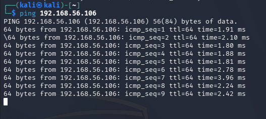
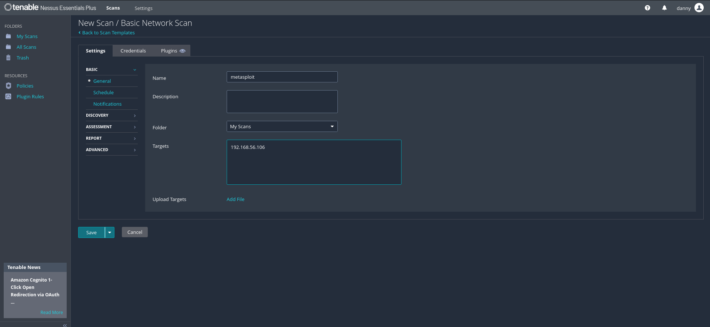
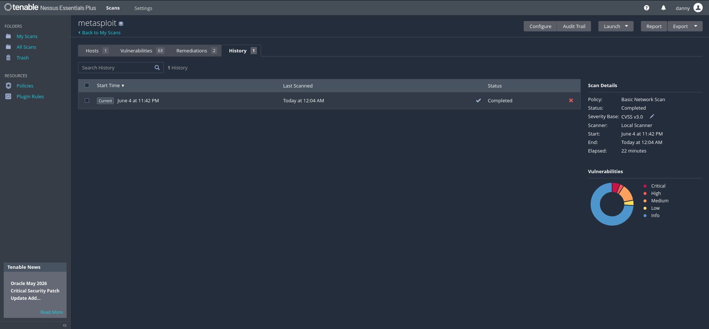
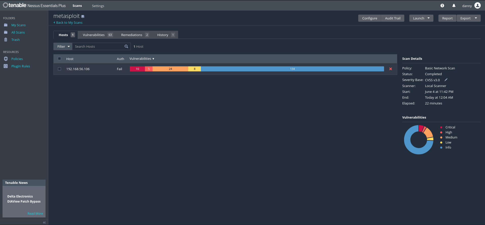
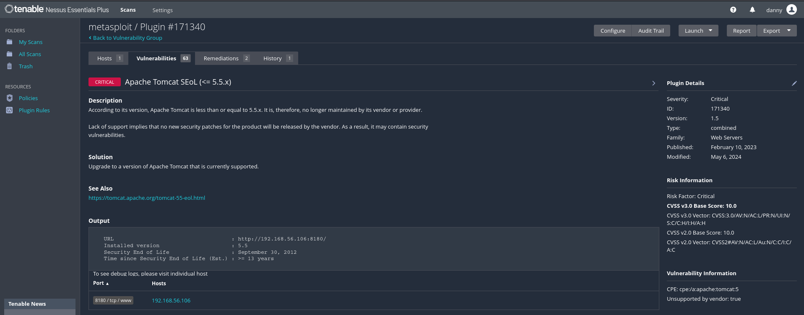
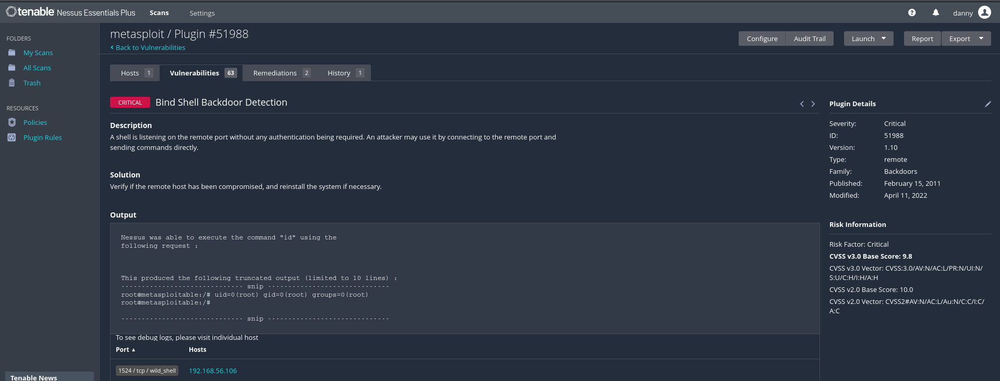
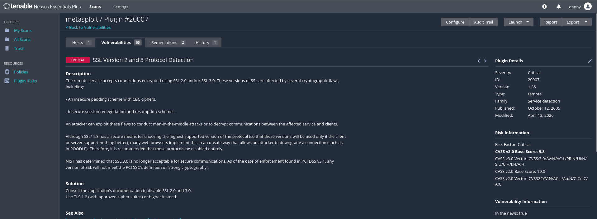
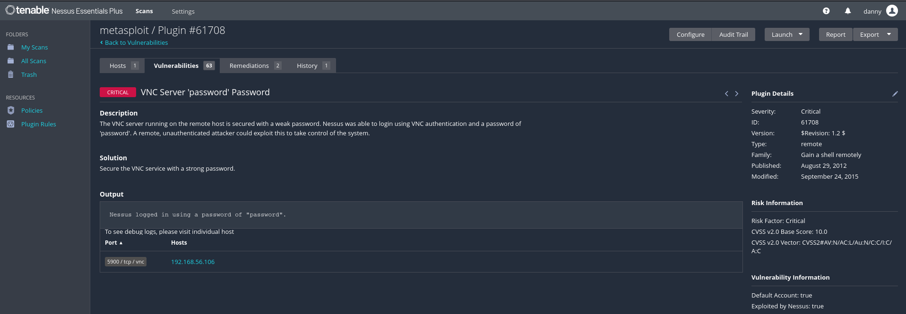

# Lab 1 - Host-Based Vulnerability Assessment


## 📋 Objective

To identify, classify, and prioritise vulnerabilities on a target host using automated scanning tools - **not** to exploit them. This lab demonstrates how vulnerability scanners detect and categorise security weaknesses, and how to interpret findings in a real-world context.

---

## 🛠️ Lab Environment

| Component | Details |
|---|---|
| **Scanner Machine** | Kali Linux |
| **Target Machine** | Metasploitable2 |
| **Target IP** | 192.168.56.106 |
| **Scanning Tool** | Nessus Essentials Plus |
| **Scan Policy** | Basic Network Scan |
| **Severity Baseline** | CVSS v3.0 |
| **Network Type** | Host-Only (VirtualBox) |

---

## 🔧 Methodology

### Step 1 - Network Verification
Confirmed connectivity between Kali Linux and Metasploitable2 before initiating the scan.

```bash
ping 192.168.56.106
```



Output confirmed the target was reachable with response times averaging ~2ms.

### Step 2 - Scan Configuration
- Selected scan template: **Basic Network Scan**
- Created a new scan in Nessus named **"metasploit"**
- Set target to `192.168.56.106`




### Step 3 - Scan Execution
Launched the scan and waited for full completion.

| Detail | Value |
|---|---|
| Start Time | June 4 at 11:42 PM |
| End Time | June 5 at 12:04 AM |
| Elapsed | 22 minutes |
| Scanner | Local Scanner |
| Status | Completed |



### Step 4 - Result Analysis
Total vulnerabilities detected: **63 unique findings** across the host.



Top 5 vulnerabilities selected based on CVSS score and severity rating.

| Severity | Count |
|---|---|
| 🔴 Critical | 10 |
| 🟠 High | 5 |
| 🟡 Medium | 24 |
| 🟢 Low | 8 |
| ℹ️ Info | 134 |

---

## 🔍 Top 5 Vulnerabilities Found

| # | Vulnerability | Plugin ID | CVSS v3.0 | Severity | Port / Service |
|---|---|---|---|---|---|
| 1 | Apache Tomcat SEoL (<= 5.5.x) | #171340 | 10.0 | Critical | 8180 / tcp / www |
| 2 | Bind Shell Backdoor Detection | #51988 | 9.8 | Critical | 1524 / tcp / wild_shell |
| 3 | Canonical Ubuntu Linux SEoL (8.04.x) | #201352 | 10.0 | Critical | 80 / tcp / www |
| 4 | SSL Version 2 and 3 Protocol Detection | #20007 | 9.8 | Critical | Multiple ports |
| 5 | VNC Server 'password' Password | #61708 | 10.0* | Critical | 5900 / tcp / vnc |

---

## 📊 Vulnerability Analysis

### 1. Apache Tomcat SEoL (<= 5.5.x) - Plugin #171340



- **CVSS v3.0 Score:** 10.0 | **Severity:** Critical
- **Affected Port:** 8180/tcp
- **Installed Version:** Apache Tomcat 5.5 (End of Life: September 30, 2012 - over 13 years ago)
- **Description:** The installed version of Apache Tomcat is no longer maintained by its vendor. As a result, no new security patches will be released, leaving the system permanently exposed to newly discovered vulnerabilities.
- **Impact:** Any future (or existing unpatched) vulnerabilities in this version will never receive official fixes, making the system a persistent attack target.
- **Solution:** Upgrade to a currently supported version of Apache Tomcat.
- **Risk Justification:** End-of-life software is classified as Critical because the attack surface grows indefinitely with no vendor remediation path.

---

### 2. Bind Shell Backdoor Detection — Plugin #51988



- **CVSS v3.0 Score:** 9.8 | **Severity:** Critical
- **Affected Port:** 1524/tcp (wild_shell)
- **Description:** A shell is listening on port 1524 with no authentication required. Nessus confirmed exploitation by executing the `id` command, which returned `uid=0(root) gid=0(root) groups=0(root)` - confirming full root access.
- **Nessus Output:**
  ```
  root@metasploitable:/# uid=0(root) gid=0(root) groups=0(root)
  ```
- **Impact:** Any attacker who connects to this port gains an immediate root shell without any credentials. This is a pre-installed backdoor on Metasploitable2 by design.
- **Solution:** Verify if the host has been compromised; reinstall the system if necessary. In production, this port should never be open.
- **Risk Justification:** Unauthenticated remote root access represents complete system compromise.

---

### 3. Canonical Ubuntu Linux SEoL (8.04.x) - Plugin #201352

.png)

- **CVSS v3.0 Score:** 10.0 | **Severity:** Critical
- **Affected Port:** 80/tcp
- **OS Detected:** Ubuntu Linux 8.04 (End of Life: May 9, 2013 - over 13 years ago)
- **Description:** The underlying operating system is Ubuntu 8.04 (Hardy Heron), which has been unsupported since 2013. No security patches or updates are available from Canonical for this OS version.
- **Impact:** All kernel-level, OS-level, and package-level vulnerabilities discovered since 2013 remain unpatched. The OS is the foundation of all running services, making this a systemic risk.
- **Solution:** Upgrade to a currently supported Ubuntu LTS release (22.04 or 24.04).
- **Risk Justification:** An unsupported OS affects every service running on the machine - any vulnerability in the kernel or core packages cannot be remediated through patching.

---

### 4. SSL Version 2 and 3 Protocol Detection — Plugin #20007



- **CVSS v3.0 Score:** 9.8 | **Severity:** Critical
- **Affected Ports:** Multiple (SSL/TLS services)
- **Description:** The remote service accepts connections using SSL 2.0 and/or SSL 3.0, both of which are cryptographically broken protocols. These versions are vulnerable to insecure padding (CBC ciphers), insecure session renegotiation, and protocol downgrade attacks (e.g., POODLE).
- **Impact:** Attackers can perform man-in-the-middle attacks, decrypt encrypted communications, or downgrade connections to weaker encryption. NIST has determined SSL 3.0 is no longer acceptable for secure communications under PCI DSS v3.1.
- **Solution:** Disable SSL 2.0 and SSL 3.0 entirely. Configure services to use TLS 1.2 or higher with approved cipher suites only.
- **Risk Justification:** Broken encryption directly undermines the confidentiality and integrity of all data transmitted over these connections.

---

### 5. VNC Server 'password' Password - Plugin #61708



- **CVSS v2.0 Score:** 10.0 | **Severity:** Critical
- **Affected Port:** 5900/tcp (VNC)
- **Description:** The VNC server on the remote host uses the weak, default password `"password"`. Nessus successfully authenticated to the VNC service using this credential, confirming the finding.
- **Nessus Output:** `Nessus logged in using a password of "password".`
- **Impact:** Any attacker with network access to port 5900 can gain full graphical desktop control of the system without any specialised tools - just a VNC client and the known default password.
- **Solution:** Immediately change the VNC password to a strong, unique credential. Consider disabling VNC entirely if remote desktop access is not required.
- **Risk Justification:** Default credentials are among the most commonly exploited weaknesses in real-world attacks. This finding was confirmed exploited by Nessus itself during the scan.

---

## 💡 Key Learnings

### Finding ≠ Real Risk
Not every vulnerability flagged by a scanner is immediately exploitable in all environments. Findings #1 and #3 (both SEoL detections) are classified Critical based on the *absence of patching capability* rather than a specific active exploit. In a network with strict firewall rules or no external exposure, the immediate risk may be lower - but the long-term risk remains unaddressed.

### Why False Positives Exist
Nessus often detects vulnerabilities based on **version banners** or **configuration checks** rather than confirmed exploitation. For example, SEoL findings (#1 and #3) do not mean an attack is actively occurring - they indicate that the software *can no longer be made safe* through vendor patches. The Bind Shell Backdoor (#2) and VNC Password (#5), however, were **actively confirmed** by Nessus, making them verified true positives with zero ambiguity.

---

## 🔗 References

- [Nessus Plugin #171340 — Apache Tomcat SEoL](https://www.tenable.com/plugins/nessus/171340)
- [Nessus Plugin #51988 — Bind Shell Backdoor](https://www.tenable.com/plugins/nessus/51988)
- [Nessus Plugin #201352 — Ubuntu SEoL](https://www.tenable.com/plugins/nessus/201352)
- [Nessus Plugin #20007 — SSL v2/v3 Detection](https://www.tenable.com/plugins/nessus/20007)
- [Nessus Plugin #61708 — VNC Default Password](https://www.tenable.com/plugins/nessus/61708)
- [National Vulnerability Database (NVD)](https://nvd.nist.gov/)
- [CVSS v3.0 Specification](https://www.first.org/cvss/v3.0/specification-document)
- [Nessus Essentials — Tenable](https://www.tenable.com/products/nessus/nessus-essentials)
